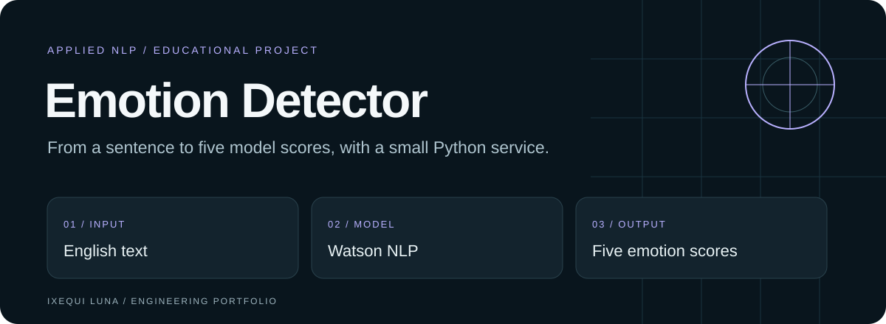
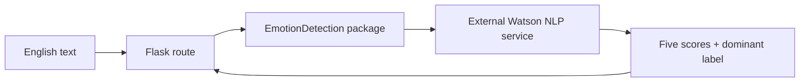

# Emotion Detector

**A small, readable journey from text input to model output.**

A Python and Flask application that sends English text to the Watson NLP Skills Network service and returns scores for **anger, disgust, fear, joy and sadness**, plus the highest-scoring label.

Built as the final project for the **IBM/Coursera Python Project for AI & Application Development** course. The course context is part of the project's provenance; this repository does not implement or train the underlying Watson model.

[Run locally](#run-locally) · [How it works](#how-it-works) · [Verification](docs/VERIFICATION.md) · [Español](README.es.md) · [Ixequi Luna](https://ixequiluna.ai)

[](https://github.com/ixequiluna-source/oaqjp-final-project-emb-ai/actions)

## What this project demonstrates

| Layer | Engineering focus |
| --- | --- |
| Python package | A compact API wrapper with explicit request timeout and a consistent result shape. |
| Flask route | Input handling, formatted results and a 503 response when the provider request fails. |
| Browser interface | Responsive interface, five score meters, loading, cancellation, error recovery and explicit provider disclosure. |
| Tests | 15 deterministic Python tests plus Chromium/WebKit browser journeys; provider responses are mocked. |

## Run locally

Requires Python 3.11 or later and access to the external Skills Network endpoint for live inference.

```sh
git clone https://github.com/ixequiluna-source/oaqjp-final-project-emb-ai.git
cd oaqjp-final-project-emb-ai
python -m venv .venv
```

Activate the environment:

```sh
# macOS / Linux
source .venv/bin/activate
```

```powershell
# Windows PowerShell
.venv\Scripts\Activate.ps1
```

Then install, test and start:

```sh
python -m pip install -r requirements.txt
python -m unittest discover -v
python server.py
```

Open **http://localhost:5000**. Use non-sensitive sample text such as `I am glad this happened`. The supplied development server binds to loopback (127.0.0.1).

## How it works



```python
from EmotionDetection import emotion_detector

result = emotion_detector("I am glad this happened")
print(result["dominant_emotion"])
```

The label depends on the external response. Unit tests substitute known responses to verify wrapper behavior; they do **not** establish model accuracy or provider availability. Empty input produces `None` values without sending a provider request. A network failure must not be replaced with invented scores.

## Find your way around

| File | Purpose |
| --- | --- |
| [Packaged implementation](EmotionDetection/emotion_detection.py) | Provider request and score extraction. |
| [Server](server.py) | Flask routes and provider-unavailable response. |
| [Tests](test_emotion_detection.py) | Mocked dominant-label checks. |
| [Template](templates/index.html) | Browser interface. |
| [Browser script](static/mywebscript.js) | Request and result rendering. |
| [Compatibility module](emotion_detection.py) | Preserves the course's top-level import form. |

## Current boundaries

This is an educational integration, not a mental-health assessment or a production service. Text is sent to an external provider. The interface sends JSON with POST `/api/emotions`, limited to 2,000 characters, so submitted text is absent from the request URL. The legacy GET `/emotionDetector` route remains for course compatibility and can expose query text in access logs; do not use it for sensitive input. No authentication or production rate limiter is supplied.

The current frontend does not display non-200 failures, and successful provider payloads are not fully schema-validated. These are explicit next improvements, alongside a clearer loading/error experience and privacy-conscious request handling. [See the review](docs/VERIFICATION.md).

## Author and provenance

Project implementation maintained by **[Dr. Ixequi Luna](https://ixequiluna.ai)**, within the IBM/Coursera course context. Watson supplies the model inference. Existing course artifacts and history are retained.
